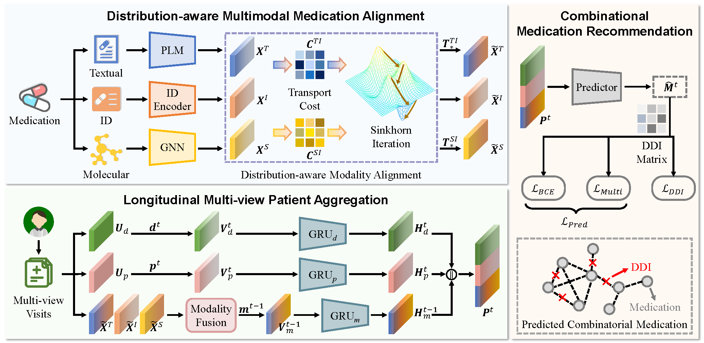

# MedAlign: Enhancing Combinatorial Medication Recommendation with Multi-modality Alignment

This repository contains an implementation of our "MedAlign: Enhancing Combinatorial Medication Recommendation with Multi-modality Alignment" accepted by MM 2025.



## Requirements

- Python == 3.8.10
- Pytorch == 1.12.0
- rdkit == 2023.3.2
- dgl == 1.13.1
- pandas == 2.0.3
- matplotlib == 3.5.2

## Data

In compliance with PhysioNet Clinical Database usage requirements, we are unable to share the dataset directly. Researchers interested in accessing the data can request permission via the following resources: [MIMIC-III](https://physionet.org/content/mimiciii/1.4/) and [MIMIC-IV](https://physionet.org/content/mimiciv/2.2/).

The structure of the data set should be like,

```Python
data
|_ raw
|  |_ DIAGNOSES_ICD.csv
|  |_ PRESCRIPTIONS.csv
|  |_ PROCEDURES_ICD.csv
|  |_ drug-atc.csv
|  |_ drug-DDI.csv
|  |_ idx2SMILES.pkl
|  |_ ndc2atc_level4.csv
|  |_ ndc2RXCUI.txt
```

After processing, the structure of the data set should be like,

```Python
data
|_ ready
|  |_ atc3toSMILES.pkl
|  |_ ddi_A_final.pkl
|  |_ ddi_mask_H.pkl
|  |_ drug_smile.pkl
|  |_ ehr_adj_final.pkl
|  |_ records_final.pkl
|  |_ smile_sub_b.pkl
|  |_ smile_sub_degree_b.pkl
|  |_ smile_sub_recency_b.pkl
|  |_ smile_sub_voc_b.pkl
|  |_ smile_sub.pkl
|  |_ voc_final.pkl
|  |_ drug_text_embs.pkl # (Pre-included)
```

Thanks to the [GAMENet](https://github.com/sjy1203/GAMENet) and [DEPOT](https://github.com/xmed-lab/DrugRec) repo for sharing their preprocessing codes.

## Running the code

To run the code, execute the following command:

### Data preprocessing

Please download MIMIC data and put it in ../data/raw

```Python
cd ../data
python process.py
```

### Training

```Python
cd ../src
python main.py
```

### Saved checkpoint

Checkpoints are saved under:

```Python
../log/MIMIC-III
../log/MIMIC-IV
```

## Citing

If you find our work useful for your research, please consider citing us:

```Python
@inproceedings{lv2025medalign,
  title={MedAlign: Enhancing Combinatorial Medication Recommendation with Multi-modality Alignment},
  author={Lv, Hang and Guo, Zixuan and Wu, Zijie and Tan, Yanchao and Ma, Guofang and Lin, Zhigang and Chen, Xiping and Cheng, Hong and Yang, Carl},
  booktitle={Proceedings of the 33rd ACM International Conference on Multimedia},
  year={2025}
}
```

